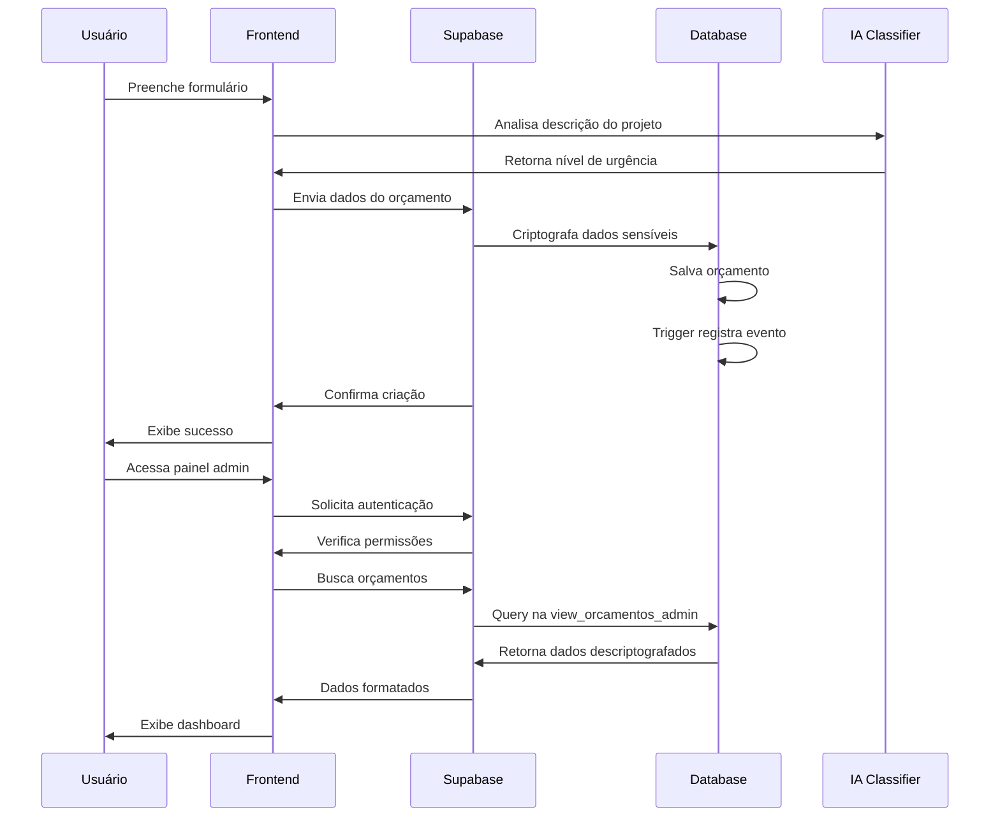
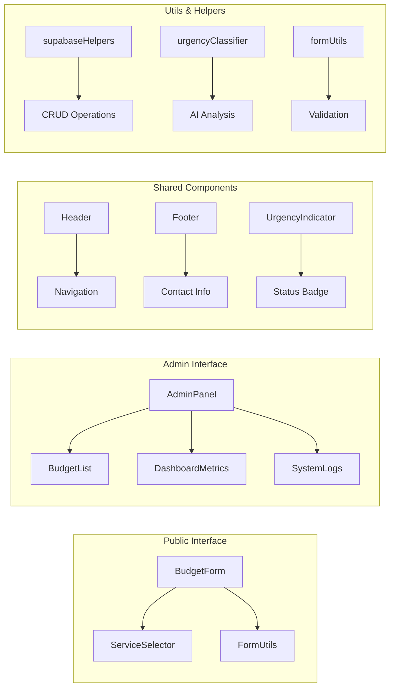
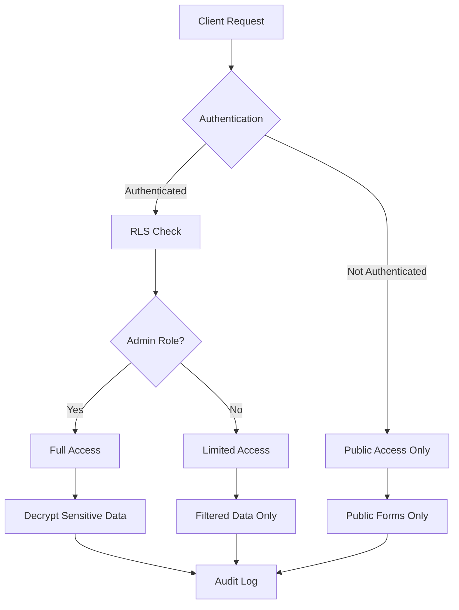

# Diagrama de Arquitetura - Vello Group

## Arquitetura do Sistema

```mermaid
graph TB
    subgraph "Frontend - React App"
        A[App.tsx] --> B[Header Component]
        A --> C[Public Interface]
        A --> D[Admin Panel]
        
        C --> E[BudgetForm]
        C --> F[ServiceSelector]
        
        D --> G[BudgetList]
        D --> H[DashboardMetrics]
        D --> I[SystemLogs]
        
        E --> J[FormUtils]
        E --> K[UrgencyClassifier]
    end
    
    subgraph "State Management"
        L[React Query] --> M[Supabase Helpers]
        M --> N[Custom Hooks]
    end
    
    subgraph "Backend - Supabase"
        O[Authentication] --> P[Row Level Security]
        Q[Database Tables] --> R[orcamentos]
        Q --> S[logs_eventos]
        Q --> T[logs_erros]
        
        U[Database Views] --> V[view_orcamentos_admin]
        U --> W[view_orcamentos_pendentes]
        U --> X[view_orcamentos_por_servico]
        
        Y[Functions] --> Z[criptografar_email]
        Y --> AA[descriptografar_email]
        Y --> BB[criptografar_telefone]
        Y --> CC[descriptografar_telefone]
        
        DD[Triggers] --> EE[registrar_evento_orcamento]
        DD --> FF[update_updated_at_column]
    end
    
    subgraph "Security Layer"
        GG[Data Encryption] --> HH[AES Encryption]
        II[Access Control] --> JJ[RLS Policies]
        KK[Audit Trail] --> LL[Event Logs]
        KK --> MM[Error Logs]
    end
    
    subgraph "AI Integration"
        NN[Urgency Classifier] --> OO[Text Analysis]
        NN --> PP[Priority Assignment]
    end
    
    %% Connections
    A -.-> L
    L -.-> O
    M -.-> Q
    M -.-> U
    M -.-> Y
    E -.-> NN
    G -.-> Q
    H -.-> U
    I -.-> S
    I -.-> T
    
    %% Styling
    classDef frontend fill:#e1f5fe
    classDef backend fill:#f3e5f5
    classDef security fill:#fff3e0
    classDef ai fill:#e8f5e8
    
    class A,B,C,D,E,F,G,H,I,J,K frontend
    class O,P,Q,R,S,T,U,V,W,X,Y,Z,AA,BB,CC,DD,EE,FF backend
    class GG,HH,II,JJ,KK,LL,MM security
    class NN,OO,PP ai
```

## Fluxo de Dados

```mermaid
sequenceDiagram
    participant U as Usuário
    participant F as Frontend
    participant S as Supabase
    participant D as Database
    participant AI as IA Classifier
    
    %% Fluxo de Criação de Orçamento
    U->>F: Preenche formulário
    F->>AI: Analisa descrição do projeto
    AI->>F: Retorna nível de urgência
    F->>S: Envia dados do orçamento
    S->>D: Criptografa dados sensíveis
    D->>D: Salva orçamento
    D->>D: Trigger registra evento
    S->>F: Confirma criação
    F->>U: Exibe sucesso
    
    %% Fluxo de Visualização Admin
    U->>F: Acessa painel admin
    F->>S: Solicita autenticação
    S->>F: Verifica permissões
    F->>S: Busca orçamentos
    S->>D: Query na view_orcamentos_admin
    D->>S: Retorna dados descriptografados
    S->>F: Dados formatados
    F->>U: Exibe dashboard
```

## Componentes Principais

```mermaid
graph LR
    subgraph "Public Interface"
        A[BudgetForm] --> B[ServiceSelector]
        A --> C[FormUtils]
    end
    
    subgraph "Admin Interface"
        D[AdminPanel] --> E[BudgetList]
        D --> F[DashboardMetrics]
        D --> G[SystemLogs]
    end
    
    subgraph "Shared Components"
        H[Header] --> I[Navigation]
        J[Footer] --> K[Contact Info]
        L[UrgencyIndicator] --> M[Status Badge]
    end
    
    subgraph "Utils & Helpers"
        N[supabaseHelpers] --> O[CRUD Operations]
        P[urgencyClassifier] --> Q[AI Analysis]
        R[formUtils] --> S[Validation]
    end
```

## Estrutura de Segurança

```mermaid
graph TD
    A[Client Request] --> B{Authentication}
    B -->|Authenticated| C[RLS Check]
    B -->|Not Authenticated| D[Public Access Only]
    
    C --> E{Admin Role?}
    E -->|Yes| F[Full Access]
    E -->|No| G[Limited Access]
    
    F --> H[Decrypt Sensitive Data]
    G --> I[Filtered Data Only]
    D --> J[Public Forms Only]
    
    H --> K[Audit Log]
    I --> K
    J --> K
```
