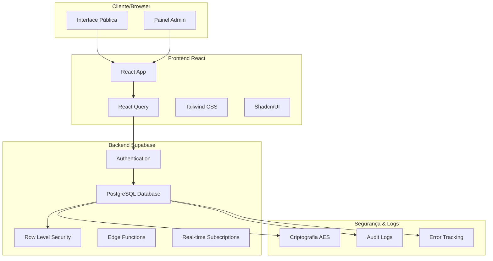
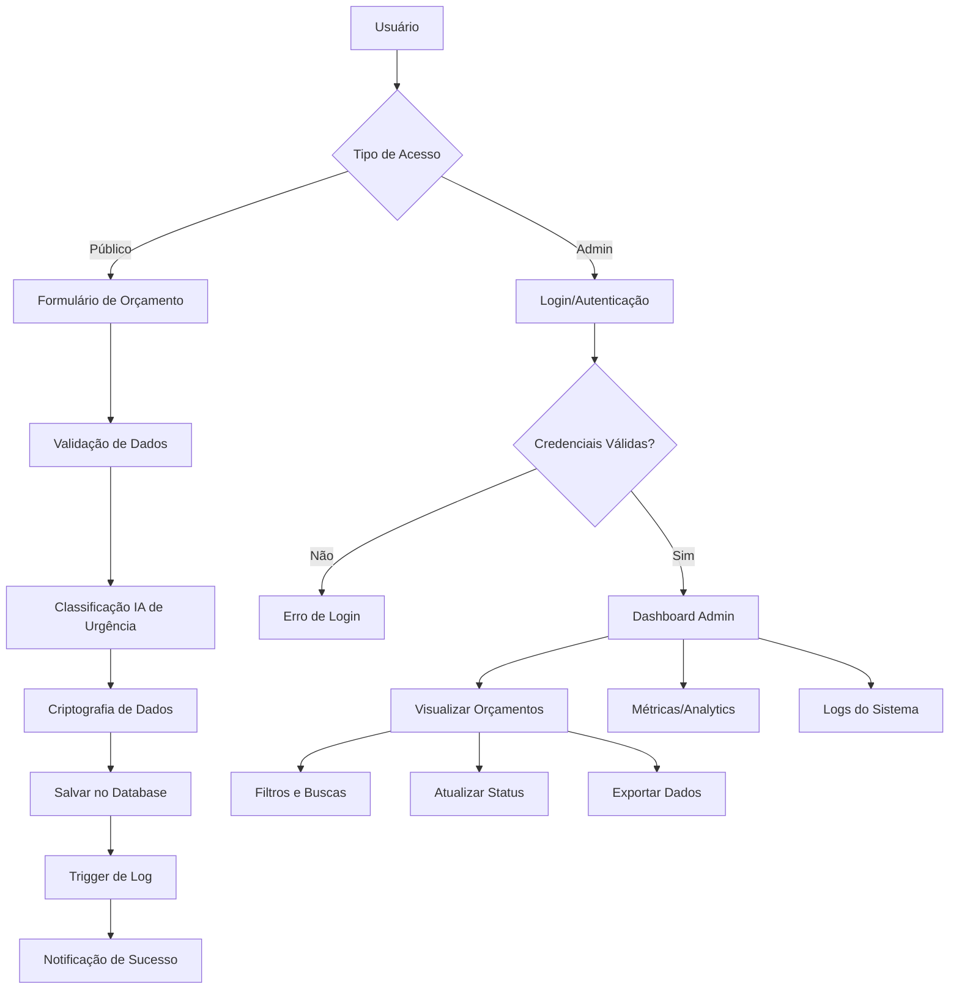
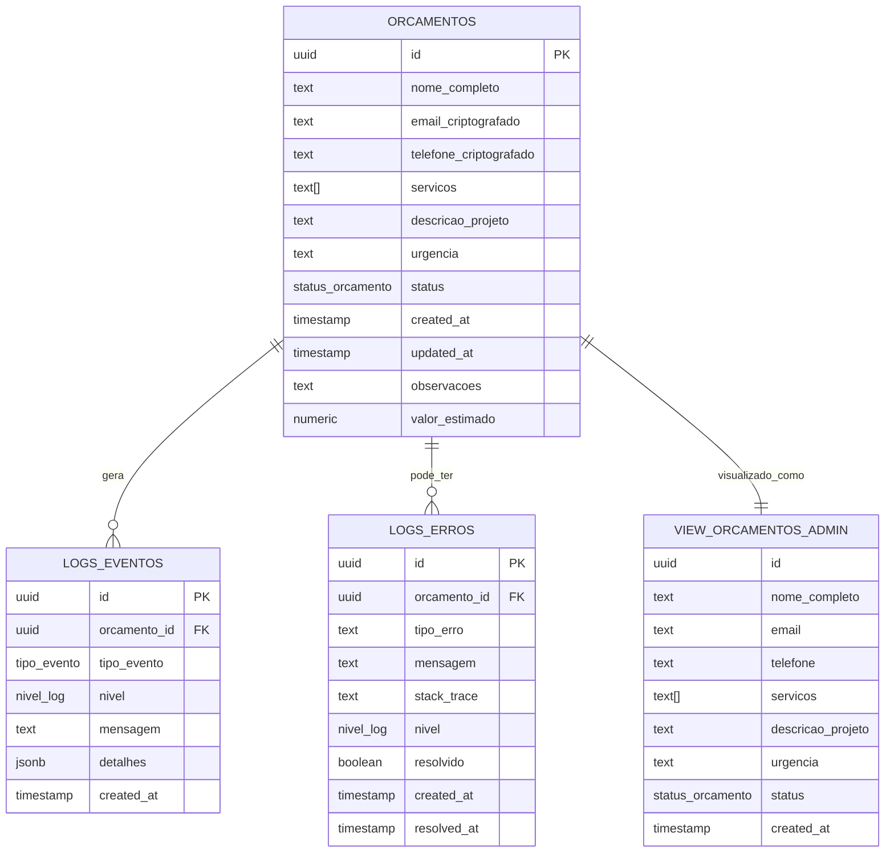
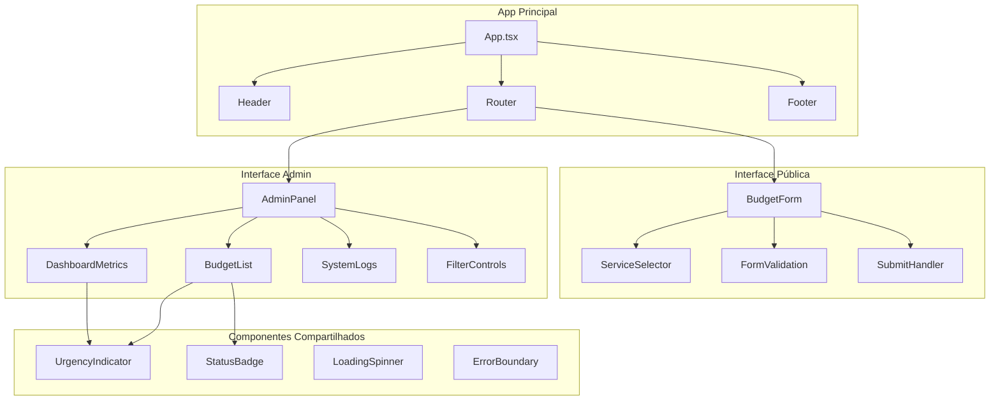
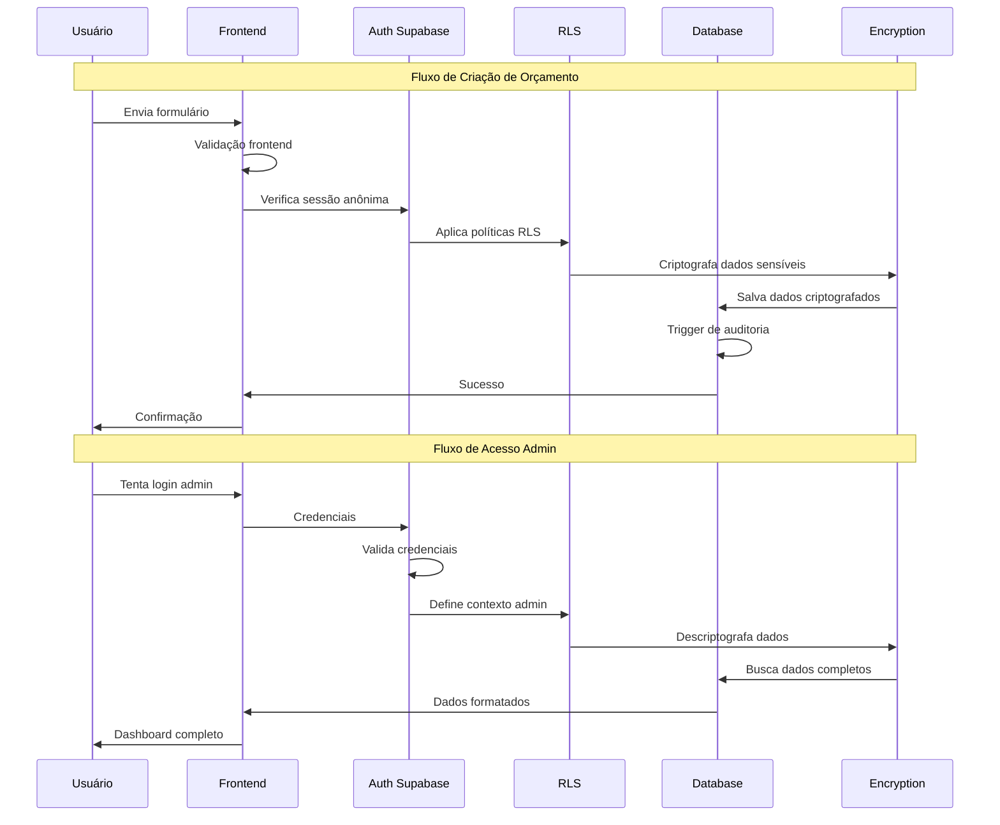
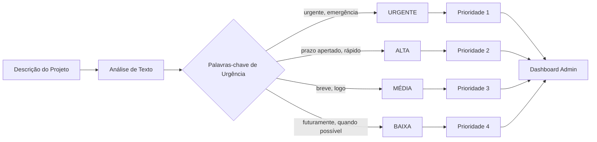
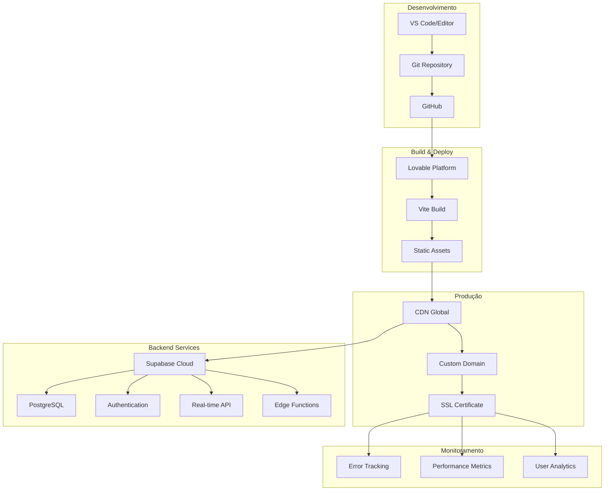

# Diagramas Mermaid.js - Vello Group

Este arquivo contém todos os diagramas em formato Mermaid.js para fácil cópia e uso em diferentes ferramentas.

## Como usar:

1. **GitHub/GitLab**: Cole o código diretamente em arquivos .md
2. **Mermaid Live Editor**: https://mermaid.live/
3. **Draw.io**: Importe usando a funcionalidade "Insert > Advanced > Mermaid"
4. **Notion**: Use blocos de código com tipo "mermaid"
5. **VS Code**: Use a extensão "Mermaid Preview"

## 1. Arquitetura Geral do Sistema

## 2. Fluxo de Dados Detalhado

## 3. Estrutura do Banco de Dados

## 4. Componentes React

## 5. Fluxo de Segurança

## 6. Classificação de Urgência por IA

## 7. Deploy e Infraestrutura

